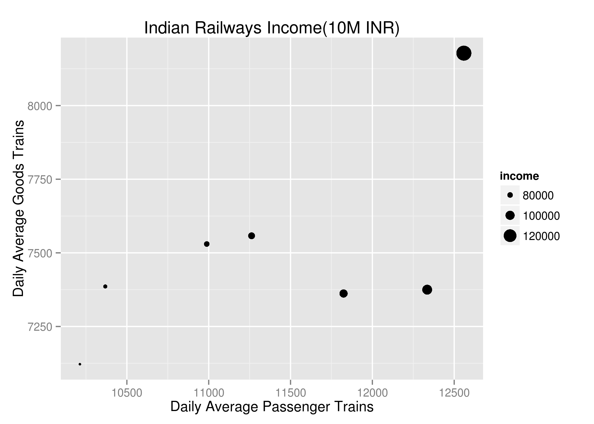

## Executive Summary
Indian Railways  is an Indian state-owned enterprise. It is one of the world's largest railway networks comprising 115,000 km  of track over a route of 65,808 km and 7,112 stations. In 2014-15, it carried 8.397 billion passengers annually or more than 23 million passengers a day  and 1058.81 million tons of freight in the year. Some Indian Railway  data are available from Indian Governement's Open Data platform. The passenger and goods train traffic data and Income data are used to  investigate the contribution of each type of traffic to the income. A Shiny app is developed  for predicting the income based on daily average train traffic(Passenger/Goods).


##Introduction
Indian Railways `r citep("https://en.wikipedia.org/wiki/Indian_Railways")`   is an Indian state-owned enterprise. It is one of the world's largest railway networks comprising 115,000 km  of track over a route of 65,808 km and 7,112 stations. In 2014-15, it carried 8.397 billion passengers annually or more than 23 million passengers a day  and 1058.81 million tons of freight in the year. Traffic and financial data are available from Indian government's open data website.`r citep("https://data.gov.in/catalog/average-number-trains-run-daily")` 
`r citep("https://data.gov.in/catalog/financial-position-indian-railways")`

## Data
The income data is presented as a bubble chart with daily average passenger trains and daily average goods traffrmarkdown::render("tutorial.Rmd")ic for the years 2006-07 to 2012-13.



```


## Model
A simple linear regression model is fit to the data. The fit quality is acceptable as can be seen from the R^2 parameter and F statistic. The model shows that one daily goods train generates 60% more income than one daily passenger train. 
```{r}
library(knitcitations)
irfa<-read.csv("../data/Indian rail traffic net revenues.csv")
fit1<-lm(income~psgr_trains+goods_trains,data=irfa)
summary(fit1)
par(mfrow=c(2,2))
plot(fit1)
```

## Shiny Application
A Shiny app called ["IndianRailways"](https://arjunaraoc.shinyapps.io/IndianRailways) is developed to help predict the income for a given daily average passenger and goods train traffic. The UI is shown below. 


## Conclusion
The passenger and goods train traffic data and Income data are used to  investigate the contribution of each type of traffic to the Indian Railways income.  The model shows that one daily goods train generates 60% more income than one daily passenger train.  A Shiny app is developed  for predicting the income based on daily average train traffic(Passenger/Goods).

```{r,echo=F,message=F}
write.bibtex(file="references.bib")
```
## References 

